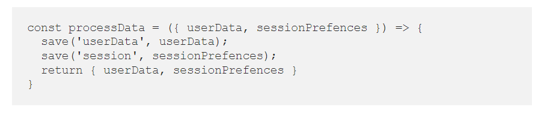
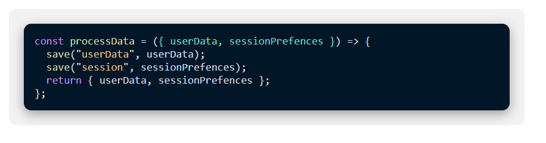

### this code extension change code block form this style: 

### to this style:

## how to install:

1. first clone the repo
2. navigate to this address in chrome: **chrome://extensions/**
3. enable **Developer mode** in top right corner
4. click on **Load unpacked** button
5. from upload window select **extension-build** that is inside the repo.
